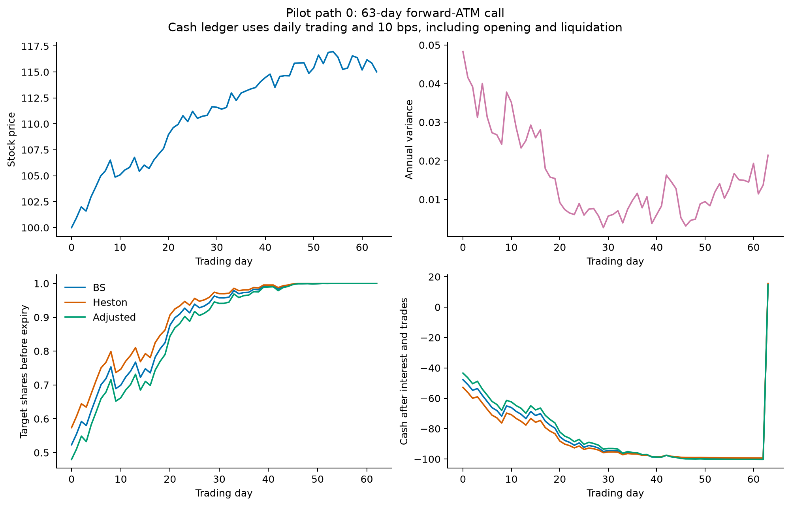
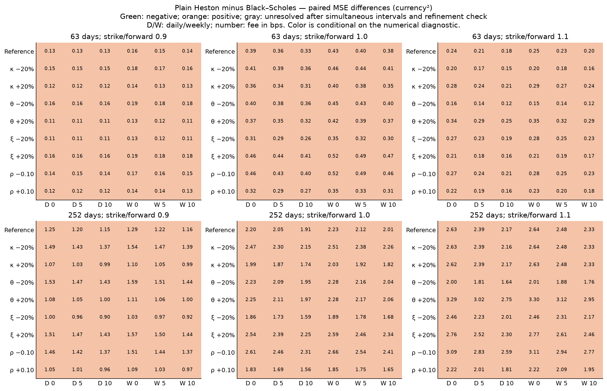
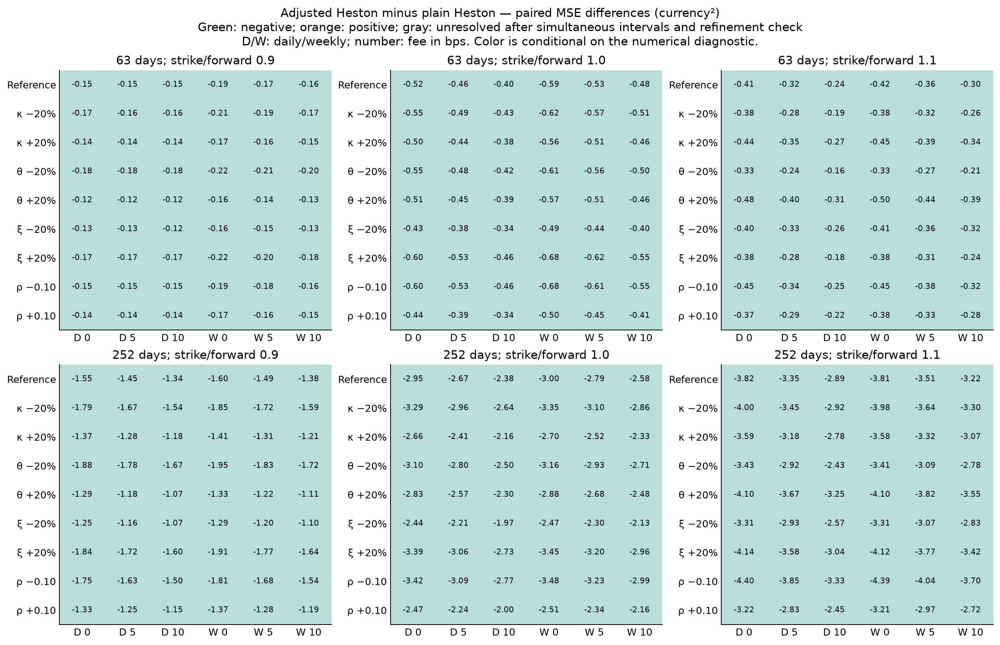

# Completed simulation procedure and results

All five stages are complete: the design was frozen, a pilot path and its cash ledgers were inspected, the three-strategy pilot passed validation, and E1–E3 ran across the full contract grid. The main study completed on 23 September 2026 at 21:13 EDT (24 September 01:13 UTC), using 4,096 common paths. The pilot used 128 separate paths; the eight-versus-sixteen-step check used 512 separate, coupled paths. No paths were excluded from any completed research run.

The main finding is consistent across the tested grid: plain Heston has higher terminal MSE than contract-specific IV Black–Scholes, while correlation-adjusted Heston has lower MSE than plain Heston. All 648 prespecified strategy contrasts retain these signs under the simultaneous Monte Carlo intervals and the stated numerical-sensitivity diagnostic. No reversal or model-indifference boundary was identified in these settings. This is evidence about one simulated regime and the selected errors and trading rules.

## 1. What was run

The reference parameters come from [Poulsen, Schenk-Hoppé and Ewald (2009), Table 2](https://d-nb.info/1191914100/34). The observations are newly simulated. Six calls combine 63/252 days and strike/initial-forward ratios 0.9/1.0/1.1. Nine pricing-input scenarios comprise the reference and one-at-a-time ±20% errors in kappa, theta, and xi, plus ±0.10 in rho. Each scenario is crossed with 0/5/10 bps stock-trading fees and daily/five-day rebalancing: 324 cells and 972 strategy MSE estimates.

The market paths, supplied true variance, and daily BS reference-price/IV histories are shared and fixed across structural errors. Every rule starts from the same contract-specific reference option price and pays its own opening, rebalancing, and liquidation costs from cash. MSE is in currency squared per one call on one share; contracts are not pooled. [The protocol](PROTOCOL.md), [configuration](protocol.json), and [manifest](results/manifest.json) supply the exact settings and provenance.

## 2. Pilot and accounting inspection

The pilot contract has 63 trading days, strike 101.0050167, initial spot 100, and common endowment 4.6184033. Its zero-fee daily MSEs were 0.9704 for BS, 1.3640 for plain Heston, and 0.8351 for adjusted Heston. These small-sample estimates were diagnostic; they did not determine the main grid or sample size.

Path 0 was inspected with 10 bps fees to expose every cost entry. It ended at stock price 115.0155296 and payoff 14.0105129. The BS, plain, and adjusted ledgers ended with errors 1.0762894, 1.5961334, and 0.6090680. Opening holdings were approximately 0.52309, 0.57387, and 0.47983 shares. All 192 daily ledger rows reconciled; the largest arithmetic residual was 1.14e-13. The positive final errors on this single path are surpluses, not estimates of an overall ranking.

The [BS](results/ledger_BS.csv), [plain Heston](results/ledger_Heston.csv), and [adjusted Heston](results/ledger_Adjusted.csv) ledgers retain the complete arithmetic. The [notebook](02_run_and_review.ipynb) displays the sequence step by step.

## 3. E1: reference inputs

Table 1. Terminal MSE with daily trading and zero fees; lower is better.

| Days | Strike/forward | BS | Plain Heston | Adjusted Heston |
| --- | --- | --- | --- | --- |
| 63 | 0.9 | 0.5529 | 0.6846 | 0.5318 |
| 63 | 1.0 | 1.2533 | 1.6388 | 1.1149 |
| 63 | 1.1 | 0.8053 | 1.0503 | 0.6368 |
| 252 | 0.9 | 4.0108 | 5.2570 | 3.7072 |
| 252 | 1.0 | 5.5917 | 7.7887 | 4.8390 |
| 252 | 1.1 | 5.9098 | 8.5405 | 4.7252 |

Adjusted Heston has the lowest point estimate in each reference contract. The prespecified inferential comparisons are H − BS and A − H. Their simultaneous Monte Carlo intervals are shown below; they do not directly test A − BS. The latter ordering should therefore be described as a point-estimate observation here.

Table 2. Paired reference-case differences, with approximate 95% Bonferroni intervals for the complete 648-contrast family. These intervals cover Monte Carlo uncertainty, not numerical or model error.

| Days | Strike/forward | Contrast | Estimate | Simultaneous MC interval |
| --- | --- | --- | --- | --- |
| 63 | 0.9 | H − BS | 0.1317 | [0.1008, 0.1626] |
| 63 | 0.9 | A − H | -0.1528 | [-0.2024, -0.1032] |
| 63 | 1.0 | H − BS | 0.3854 | [0.3409, 0.4300] |
| 63 | 1.0 | A − H | -0.5239 | [-0.6050, -0.4428] |
| 63 | 1.1 | H − BS | 0.2450 | [0.2091, 0.2808] |
| 63 | 1.1 | A − H | -0.4135 | [-0.4869, -0.3400] |
| 252 | 0.9 | H − BS | 1.2462 | [1.0970, 1.3954] |
| 252 | 0.9 | A − H | -1.5498 | [-1.7788, -1.3208] |
| 252 | 1.0 | H − BS | 2.1971 | [1.9857, 2.4085] |
| 252 | 1.0 | A − H | -2.9498 | [-3.2860, -2.6136] |
| 252 | 1.1 | H − BS | 2.6307 | [2.3676, 2.8938] |
| 252 | 1.1 | A − H | -3.8153 | [-4.2448, -3.3857] |

For the one-year forward-ATM call, the plain-Heston penalty is 2.1971 currency² and the adjustment reduces plain-Heston MSE by 2.9498 currency². Their refinement margins are 0.0099 and 0.0174, respectively, leaving both directions unchanged under the diagnostic.

## 4. E2 and E3: input errors, fees, and trading schedules

All 324 H − BS estimates are positive, and all 324 A − H estimates are negative. None of the 648 primary comparisons is unresolved under the prespecified interval-plus-refinement rule. The tested errors change the size of the gaps without reversing either primary ordering. The complete matrices below distinguish contract conditions and retain every selected error, fee, and schedule.

Sensitivity varies with the contract. For example, increasing theta by 20% reduces the short-maturity ITM point estimate of H − BS but increases the corresponding OTM estimate. Such changes describe the observed estimates; the prespecified intervals assess strategy differences within each cell, not separate tests of differences between parameter scenarios. Three error levels per parameter do not establish monotonicity or a continuous boundary.

Trading fees can reduce this study's MSE because the loss penalizes positive surplus as well as shortfall. For the one-year forward-ATM reference case with daily trading, raising fees from 0 to 10 bps lowers BS MSE from 5.5917 to 4.0924 while lowering its mean error from 1.5190 to 0.9253. The strategy pays average nominal fees of 0.5827. For adjusted Heston in that comparison, error variance rises from 3.0241 to 3.0540 while mean error falls from 1.3472 to 0.7521; the decline in squared mean error outweighs the variance increase. This does not mean fees increase profit. The pattern is conditional: for the 63-day OTM reference call with daily trading, adjusted-Heston MSE is 0.6368, 0.6364, and 0.6687 at 0, 5, and 10 bps, respectively. Actual costs are paid once and their financing effect is already included in the terminal cash balance.

For the one-year forward-ATM reference contract at 10 bps, daily versus five-day MSE is 4.0924 versus 5.5807 for BS, 6.0040 versus 7.5860 for plain Heston, and 3.6197 versus 5.0098 for adjusted Heston. These point estimates show the trading-frequency comparison under fixed daily information updates. The frequency and cost effects should be described conditionally, without inferring a general optimal schedule.

## 5. Validation, uncertainty, and failures

- All 22 deterministic accounting checks and eight path-generation checks passed. A separate saved-output audit reconciled all three completed grids, every MSE, paired mean, and paired standard error. Maximum saved-summary MSE residual was 1.78e-15. BS outcomes were bitwise identical across structural-error settings at fixed trading conditions.
- The 900-case pricing/Greek grid passed its declared tolerances. Maximum price discrepancy was 1.84e-9 currency units, spot-delta discrepancy 3.76e-8 shares, and variance-derivative discrepancy 1.18e-4 currency units per variance unit. An additional 640-state price stress audit passed, with maximum discrepancy 4.37e-9.
- Across the separate coupled refinement sample, the maximum absolute change in a primary contrast was 0.01235 currency². The maximum strategy-specific MSE change was 0.02118. Contrast signs remained unchanged after the prespecified main-interval expansion. This check does not prove a bound on discretization bias or supply joint 95% numerical-error coverage.
- The largest 1% of path losses contributed a median 8.19% and a maximum 21.86% of MSE across strategy cells. [Nested-sample and batch estimates](results/batch_contrasts.csv) and [paired summaries](results/paired_contrasts.csv) are retained. Approximate t intervals assume IID paths and finite variance of squared-loss differences; these diagnostics cannot establish that tail assumption.
- The main path generator recorded 561 negative latent-variance substeps out of 8,257,536, and 64 daily zero-variance observations. Full truncation retained these paths. The main pricer evaluated 34,836,486 Heston states, accepted 435,629 checked Fourier refinements, and used 222,499 scalar fallback evaluations. It recorded 4,617 recoveries using the alternate integration method, 142 fallback variance regularizations, and 260,727 roundoff price-bound corrections. These counts concern numerical evaluations, not excluded paths.
- Of 3,870,720 reference-price inversions, 64,174 used the documented zero-time-value limit. IV is poorly identified near intrinsic value; a pilot comparison found a large raw-IV change at one such observation but a delta change of only about 3.3e-12 shares. The benchmark histories were frozen within each completed experiment.

The initial pilot attempt stopped on a numerical integration limit before hedge outcomes. Its log was retained and the same seed was rerun after correcting integration. [The development log](DEVELOPMENT_LOG.md) records this and the checked pricing refinement. Completed production runs had no unhandled numerical failures and no exclusions. Full diagnostics and checks are in [results/validation/](results/validation/).

## 6. Manuscript interpretation

The manuscript now contains the abstract, discussion, limitations, and conclusion. Section 4 combines data and methods, Section 5 reports these results, and Appendix A records numerical details. The discussion distinguishes the combined model-specification comparison from the isolated correlation correction and explains why costs can lower MSE while reducing cash.

The conclusion states that plain Heston's additional specification did not improve terminal MSE over the selected IV benchmark in this regime, whereas the correlation correction consistently improved plain Heston. The grid does not establish a universal ordering, a unique indifference boundary, an empirical calibration-error distribution, or a direct inferential comparison between adjusted Heston and BS. Observed variance, model-generated reference prices, one market regime, symmetric funding, and the finite grid restrict external validity. Claims about calibration or computational value need separate evidence.

The code and compact outputs support reproduction; raw paths, reference histories, and pathwise errors are retained locally in the repository-root `outputs/` directory. The main calculation took 691.8 seconds on this computer, but runtime was not benchmarked across methods and is not a measure of total implementation value. [Software and assistance](SOFTWARE_AND_ASSISTANCE.md) documents the packages, agent assistance, and the verified Scientific Agent Skills citation.

## Review record

| Check | Assessment |
|---|---|
| Contribution | Answers the two retained hedging comparisons within the tested grid; broader novelty remains limited by the inspected sources. |
| Writing | Data, method, numerical evidence, and findings have separate roles; academic review preceded the Humanizer pass. |
| Experimental controls | Common paths/endowment, identical Heston inputs, fixed actual benchmark histories, and separate information/trading schedules are implemented. |
| Evaluation | MSE remains primary; paired uncertainty, multiplicity, tails, convergence, and numerical recoveries are disclosed. |
| Method limits | Synthetic regime and selected errors; no empirical test or proof of numerical/Monte Carlo coverage. |
